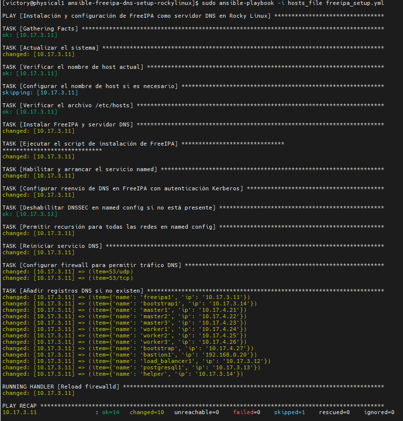

# README.md

## Instalación de Ansible en Rocky Linux 9.4

Para instalar Ansible en tu sistema Rocky Linux 9.4, sigue estos pasos:

1. **Agregar el repositorio de EPEL** (Extra Packages for Enterprise Linux), ya que Ansible suele estar disponible en este repositorio:

    ```bash
    sudo dnf install epel-release -y
    ```

2. **Instalar Ansible**:

    ```bash
    sudo dnf install ansible -y
    ```

3. **Verificar la instalación**:

    ```bash
    ansible --version
    ```

4. **Clonar el repositorio**:

    ```bash
    sudo git clone https://github.com/vhgalvez/ansible-freeipa-dns-setup-rockylinux.git
    ```

Esto instalará Ansible y lo preparará para ejecutar playbooks en tu sistema.

## Ejecutar un Playbook de Ansible en un Servidor Remoto usando SSH

A continuación, se muestra una guía paso a paso para ejecutar un playbook de Ansible en tu servidor remoto usando SSH:

### Paso 1: Verificar la Conectividad con SSH

Primero, asegúrate de que puedes conectarte al servidor remoto con el siguiente comando SSH:

```bash
sudo ssh -i /root/.ssh/cluster_openshift/key_cluster_openshift/id_rsa_key_cluster_openshift core@10.17.3.11 -p 22
```

Si esta conexión funciona, tu clave SSH está configurada correctamente y podrás conectarte desde Ansible.

### Paso 2: Configurar el Inventario de Ansible

Crea un archivo de inventario para definir el servidor remoto. Puedes nombrarlo `inventory.ini` y añadir el siguiente contenido:

```ini
[freeipa_servers]
10.17.3.11 ansible_user=core ansible_ssh_private_key_file=/root/.ssh/cluster_openshift/key_cluster_openshift/id_rsa_key_cluster_openshift ansible_port=22
```

Este archivo indica a Ansible que se conecte al servidor `10.17.3.11` como usuario `core`, usando la clave SSH especificada.

### Paso 3: Crear el Playbook de Ansible

Guarda el playbook YAML que compartiste en un archivo, por ejemplo, `freeipa_setup.yml`.

### Paso 4: Ejecutar el Playbook de Ansible

Ejecuta el playbook con el siguiente comando, especificando el archivo de inventario:

```bash
sudo ansible-playbook -i hosts_file freeipa_setup.yml
```

### Paso 5: Monitorear la Ejecución

Ansible mostrará el progreso de cada tarea en el playbook. Si alguna tarea falla, revisa los mensajes de error para diagnosticar el problema.


### Paso 6: Verificar la Configuración

Una vez que Ansible haya terminado de ejecutar el playbook, verifica que la configuración se haya aplicado correctamente en el servidor remoto.


```bash
sudo klist
```


```bash
sudo kinit admin
```

```bash
sudo ipa dnsrecord-find cefaslocalserver.com
```

Verificar la resolución DNS desde una VM

```bash
dig physical1.cefaslocalserver.com
dig freeipa1.cefaslocalserver.com
dig bootstrap1.cefaslocalserver.com
dig master1.cefaslocalserver.com
dig google.com
```
```bash
ping -c 4 physical1.cefaslocalserver.com
ping -c 4 bootstrap1.cefaslocalserver.com
ping -c 4 master1.cefaslocalserver.com
ping -c 4 google.com
```


sudo systemctl enable named


Verificar el estado del servicio DNS

```bash
sudo systemctl enable named
sudo systemctl start named
sudo systemctl status named
```

Verificar la configuración del firewall en el servidor FreeIPA
Asegúrate de que el firewall permite el tráfico DNS en los puertos 53 TCP/UDP.

## Resumen de Recursos para Máquinas Virtuales

- Resumen de Recursos para Máquinas Virtuales

| Nombre de VM  | CPU | Memoria (MB) | IP         | Nombre de Dominio                  | Tamaño de Disco (GB) | Hostname      |
| ------------- | --- | ------------ | ---------- | ---------------------------------- | -------------------- | ------------- |
| master1       | 2   | 4096         | 10.17.4.21 | master1.cefaslocalserver.com       | 50                   | master1       |
| master2       | 2   | 4096         | 10.17.4.22 | master2.cefaslocalserver.com       | 50                   | master2       |
| master3       | 2   | 4096         | 10.17.4.23 | master3.cefaslocalserver.com       | 50                   | master3       |
| worker1       | 2   | 4096         | 10.17.4.24 | worker1.cefaslocalserver.com       | 50                   | worker1       |
| worker2       | 2   | 4096         | 10.17.4.25 | worker2.cefaslocalserver.com       | 50                   | worker2       |
| worker3       | 2   | 4096         | 10.17.4.26 | worker3.cefaslocalserver.com       | 50                   | worker3       |
| bootstrap     | 2   | 4096         | 10.17.4.27 | bootstrap.cefaslocalserver.com     | 50                   | bootstrap     |
| freeipa1      | 2   | 2048         | 10.17.3.11 | freeipa1.cefaslocalserver.com      | 32                   | freeipa1      |
| loadbalancer1 | 2   | 2048         | 10.17.3.12 | loadbalancer1.cefaslocalserver.com | 32                   | loadbalancer1 |
| postgresql1   | 2   | 2048         | 10.17.3.13 | postgresql1.cefaslocalserver.com   | 32                   | postgresql1   |
| helper        | 2   | 2048         | 10.17.3.14 | helper.cefaslocalserver.com        | 32                   | helper_node   |





## Resumen

1. Conectar por SSH para verificar el acceso.
2. Crear el archivo de inventario (`inventory.ini`).
3. Guardar el playbook como `freeipa_setup.yml`.
4. Ejecutar el playbook con `ansible-playbook`.

Con estos pasos, Ansible debería aplicar todas las configuraciones especificadas en el playbook en tu servidor remoto.
